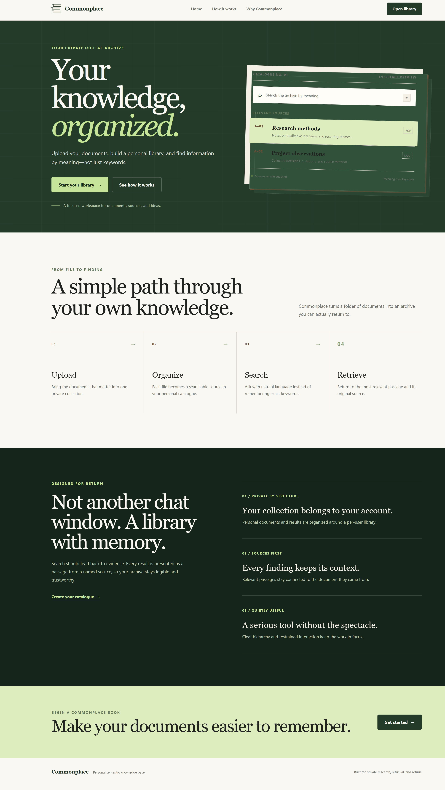

<div align="center">

# 🏛️ Commonplace

### Multi-User Semantic Knowledge Base with MCP, FastAPI, React & Qdrant

A multi-user semantic knowledge base that combines document ingestion, vector search, and the **Model Context Protocol (MCP)** to make private document collections accessible through both a web application and MCP-compatible AI clients.

<p>
  
  
  
  
  
</p>

</div>

## 📖 Overview

**Commonplace** is a semantic knowledge base designed for storing, indexing, and retrieving information from private document collections.

Instead of relying on keyword-based search, Commonplace converts document content and user queries into dense vector embeddings and retrieves semantically relevant passages using **Qdrant**.

The project exposes the same knowledge layer through two interfaces:

* **React web application** — browse documents and perform semantic searches through a visual dashboard.
* **MCP server** — expose knowledge-base capabilities as reusable tools for MCP-compatible AI clients.

The backend is built with **FastAPI**, while the MCP layer uses **FastMCP** to provide programmatic access to the semantic search capabilities.

## ✨ Features

* 👥 **Multi-user architecture** for separate knowledge-base contexts
* 📄 **Document ingestion and indexing**
* 🧠 **Semantic vector search** using sentence-transformer embeddings
* 🗄️ **Qdrant vector storage** with cosine similarity search
* 🔌 **MCP tool integration** through FastMCP
* ⚡ **FastAPI REST API** for frontend and service communication
* 🔐 **Authentication layer** for protected API routes
* 🔎 **Top-k semantic retrieval** with relevance scores
* 📚 **Document/source listing and retrieval**
* 🖥️ **React 19 frontend** for searching and exploring indexed knowledge
* 🧩 **Separated service layers** for API, MCP, authentication, and vector operations

---

## 📸 Frontend Preview

<p align="center">
  
</p>

---

## 🏗️ Architecture

Commonplace uses a layered architecture that separates the presentation, API, MCP, and vector-storage responsibilities.

```text
                         ┌─────────────────────────┐
                         │       MCP CLIENTS       │
                         │ Claude / Cursor / etc.  │
                         └────────────┬────────────┘
                                      │
                                  MCP Tools
                                      │
                                      ▼
┌─────────────────┐          ┌──────────────────────┐
│   React 19 UI   │ ───────► │   FastAPI Backend   │
│                 │  REST    │                      │
│ Search / Docs   │          │ Auth / Routes / API │
└─────────────────┘          └──────────┬───────────┘
                                        │
                                        ▼
                              ┌──────────────────────┐
                              │    MCP Service       │
                              │      Bridge          │
                              │                      │
                              │ search_notes         │
                              │ list_sources         │
                              │ get_document         │
                              └──────────┬───────────┘
                                         │
                                         ▼
                              ┌──────────────────────┐
                              │ Sentence Transformers│
                              │  Dense Embeddings    │
                              └──────────┬───────────┘
                                         │
                                         ▼
                              ┌──────────────────────┐
                              │       Qdrant         │
                              │   Vector Database    │
                              │                      │
                              │ Cosine Similarity    │
                              └──────────────────────┘
```

### Request Flow

1. A user submits a semantic query through the React interface.
2. FastAPI validates the request and authentication context.
3. The API delegates the operation to the MCP service layer.
4. The query is converted into a dense embedding.
5. Qdrant performs vector similarity search against indexed document chunks.
6. Relevant passages and similarity scores are returned.
7. FastAPI normalizes the response for the frontend.
8. The React application renders the matching documents and snippets.

The same underlying MCP tools can also be consumed by compatible AI clients.


## 🧰 Tech Stack

| Layer               | Technology                                        |
| ------------------- | ------------------------------------------------- |
| Frontend            | React 19, Vite                                    |
| Backend             | Python, FastAPI                                   |
| MCP                 | FastMCP / Model Context Protocol                  |
| Vector Database     | Qdrant                                            |
| Embeddings          | Sentence Transformers                             |
| Authentication      | JWT-based middleware / development authentication |
| Document Processing | PyPDF                                             |
| API Server          | Uvicorn                                           |
| Configuration       | python-dotenv                                     |
| Language            | Python + JavaScript                               |

---

## 🔌 MCP Tools

Commonplace exposes three core MCP tools.

### `search_notes`

Performs semantic search over the user's indexed document collection.

**Input**

```json
{
  "query": "string",
  "top_k": 5
}
```

**Example response**

```json
[
  {
    "doc_id": "e3e99d64-6baf-4843-b7aa-e9af9894ff00",
    "title": "self_help_book.pdf",
    "snippet": "toward silencing it. As soon as you discover...",
    "score": 0.47774255
  }
]
```

### `list_sources`

Returns the documents available in the current knowledge-base context.

**Returns**

```json
[
  {
    "id": "document-id",
    "title": "example.pdf"
  }
]
```

### `get_document`

Retrieves the stored content associated with a specific document identifier.

**Input**

```json
{
  "doc_id": "document-id"
}
```

## 🌐 REST API

The React application communicates with the backend through a small REST API layer.

| Method | Endpoint          | Description             | Authentication |
| ------ | ----------------- | ----------------------- | -------------- |
| `POST` | `/auth/signup`    | Create a user account   | Public         |
| `POST` | `/auth/login`     | Authenticate a user     | Public         |
| `GET`  | `/auth/me`        | Get the current user    | Bearer token   |
| `POST` | `/search`         | Perform semantic search | Bearer token   |
| `GET`  | `/documents`      | List indexed documents  | Bearer token   |
| `GET`  | `/documents/{id}` | Retrieve a document     | Bearer token   |

Interactive API documentation is available through FastAPI's Swagger UI during local development:

```text
http://localhost:8000/docs
```

## 📂 Project Structure

```text
mcp-semantic-knowledge-base/
│
├── backend/
│   ├── app.py
│   │
│   ├── mcp_server/
│   │   ├── __init__.py
│   │   └── server.py
│   │
│   ├── routes/
│   │   ├── auth_routes.py
│   │   ├── document_routes.py
│   │   └── search_routes.py
│   │
│   ├── middleware/
│   │   └── auth.py
│   │
│   ├── services/
│   │   └── mcp_service.py
│   │
│   └── requirements.txt
│
├── frontend/
│   ├── src/
│   │   ├── components/
│   │   ├── services/
│   │   └── App.jsx
│   │
│   └── package.json
│
├── docs/
│   └── screenshots/
│       └── dashboard.png
│
└── README.md
```

---

## 🚀 Getting Started

### Prerequisites

Make sure the following are installed:

* Python 3.12+
* Node.js 18+
* npm
* Qdrant

You can run Qdrant locally or connect the application to a remote Qdrant instance.

### 1. Start Qdrant

For a local Qdrant instance, make sure the service is available at:

```text
http://localhost:6333
```

Verify the service:

```bash
curl http://localhost:6333
```

---

### 2. Set Up the Backend

From the repository root:

```bash
python -m venv venv
```

Activate the virtual environment.

**Windows:**

```bash
venv\Scripts\activate
```

**macOS/Linux:**

```bash
source venv/bin/activate
```

Install dependencies:

```bash
pip install -r backend/requirements.txt
```

Start the FastAPI server:

```bash
python -m uvicorn app:app --reload --app-dir backend
```

The API will be available at:

```text
http://localhost:8000
```

Swagger documentation:

```text
http://localhost:8000/docs
```

---

### 3. Configure the Frontend

Open a second terminal:

```bash
cd frontend
npm install
```

Create:

```text
frontend/.env
```

Add:

```env
VITE_API_BASE_URL=http://localhost:8000
```

Start the development server:

```bash
npm run dev
```

The frontend will be available at:

```text
http://localhost:5173
```


## 🔐 Environment Variables

Create the required environment configuration based on your local setup.

Example:

```env
QDRANT_URL=http://localhost:6333

# Authentication / application configuration
SECRET_KEY=your-development-secret

# Frontend
VITE_API_BASE_URL=http://localhost:8000
```

> Never commit real API keys, JWT secrets, database credentials, or production environment variables to the repository.

For production deployment, these values should be configured through the hosting provider's environment-variable system.


## 🔎 Semantic Search

Commonplace uses dense vector embeddings to represent both documents and search queries in the same vector space.

```text
Document
   │
   ▼
Chunking
   │
   ▼
Sentence Transformer
   │
   ▼
Dense Vector
   │
   ▼
Qdrant
   │
   │
   │ Semantic similarity
   ▼
Top-K relevant chunks
```

The current embedding pipeline produces **384-dimensional vectors** and uses cosine similarity for semantic retrieval.

> Similarity scores represent vector similarity for individual results; they should not be interpreted as retrieval accuracy or precision metrics without a dedicated evaluation dataset.

---

## 🧪 Testing & Verification

The current development workflow verifies the system end-to-end through:

* FastAPI endpoint testing
* MCP tool invocation
* Qdrant connectivity checks
* Semantic search queries
* Frontend-to-backend requests
* Authentication flow validation
* Document retrieval validation

A dedicated automated test suite and CI pipeline can be added as the project moves toward deployment.

---

## ☁️ Deployment

### Current Status

> 🚧 **Deployment is currently in progress.**
> The application is fully runnable in a local development environment.

### Planned Production Architecture

```text
┌──────────────────────┐
│      Vercel          │
│   React Frontend     │
└──────────┬───────────┘
           │ HTTPS
           ▼
┌──────────────────────┐
│   Backend Hosting    │
│ FastAPI + Uvicorn    │
└──────────┬───────────┘
           │ HTTPS
           ▼
┌──────────────────────┐
│     Qdrant Cloud     │
│    Vector Storage    │
└──────────────────────┘
```

The intended deployment setup is:

* **Frontend:** Vercel
* **Backend:** Containerized FastAPI deployment
* **Vector database:** Qdrant Cloud
* **Secrets:** Hosting-provider environment variables
* **Transport:** HTTPS

Once deployment is complete, this section should be updated with:

* Live frontend URL
* Backend API URL
* API documentation URL
* Qdrant deployment information
* Deployment status badge
* Production architecture diagram

---

## 👥 Contributors

| Contributor        | Responsibility                            |
| ------------------ | ----------------------------------------- |
| **Suraiba Idrees** | MCP protocol layer & pipeline integration |
| **Aniqa**          | Data ingestion & Qdrant operations        |
| **Saboora**        | REST backend & authentication             |
| **Maryam**         | React frontend & UI architecture          |

---

## 🎓 Project

Developed as part of the **Zeppelin AI & Generative AI Fellowship 2026**.

## 📬 Contact / Connect
For questions, feedback, or collaboration, open an issue or reach out to the project contributors.

## 📄 License

This project is distributed under the **MIT License**.

See [`LICENSE`](LICENSE) for details.
